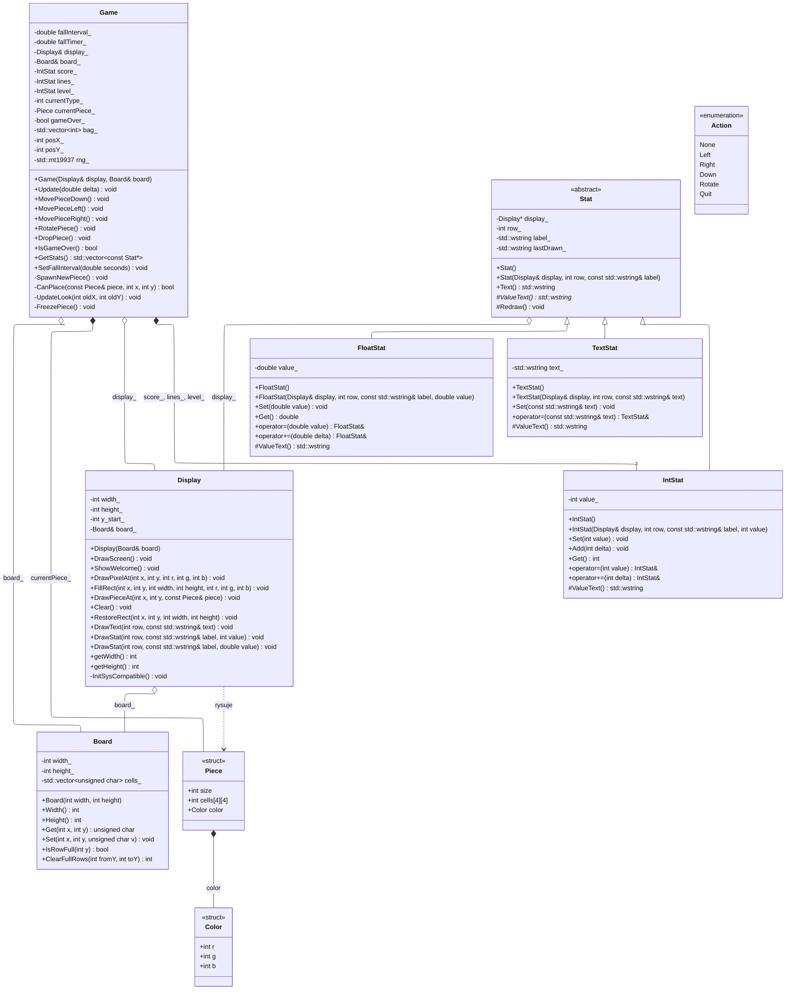

```mermaid
---
config:
  layout: elk
---
classDiagram

    class Game {
        -double fallInterval_
        -double fallTimer_
        -Display& display_
        -Board& board_
        -IntStat score_
        -IntStat lines_
        -IntStat level_
        -int currentType_
        -Piece currentPiece_
        -bool gameOver_
        -std::vector~int~ bag_
        -int posX_
        -int posY_
        -std::mt19937 rng_
        +Game(Display& display, Board& board)
        +Update(double delta) void
        +MovePieceDown() void
        +MovePieceLeft() void
        +MovePieceRight() void
        +RotatePiece() void
        +DropPiece() void
        +IsGameOver() bool
        +GetStats() std::vector~const Stat*~
        +SetFallInterval(double seconds) void
        -SpawnNewPiece() void
        -CanPlace(const Piece& piece, int x, int y) bool
        -UpdateLook(int oldX, int oldY) void
        -FreezePiece() void
    }

    class Board {
        -int width_
        -int height_
        -std::vector~unsigned char~ cells_
        +Board(int width, int height)
        +Width() int
        +Height() int
        +Get(int x, int y) unsigned char
        +Set(int x, int y, unsigned char v) void
        +IsRowFull(int y) bool
        +ClearFullRows(int fromY, int toY) int
    }

    class Display {
        -int width_
        -int height_
        -int y_start_
        -Board& board_
        +Display(Board& board)
        +DrawScreen() void
        +ShowWelcome() void
        +DrawPixelAt(int x, int y, int r, int g, int b) void
        +FillRect(int x, int y, int width, int height, int r, int g, int b) void
        +DrawPieceAt(int x, int y, const Piece& piece) void
        +Clear() void
        +RestoreRect(int x, int y, int width, int height) void
        +DrawText(int row, const std::wstring& text) void
        +DrawStat(int row, const std::wstring& label, int value) void
        +DrawStat(int row, const std::wstring& label, double value) void
        +getWidth() int
        +getHeight() int
        -InitSysCompatible() void
    }

    class Stat {
        <<abstract>>
        -Display* display_
        -int row_
        -std::wstring label_
        -std::wstring lastDrawn_
        +Stat()
        +Stat(Display& display, int row, const std::wstring& label)
        +Text() std::wstring
        #ValueText()* std::wstring
        #Redraw() void
    }

    class IntStat {
        -int value_
        +IntStat()
        +IntStat(Display& display, int row, const std::wstring& label, int value)
        +Set(int value) void
        +Add(int delta) void
        +Get() int
        +operator=(int value) IntStat&
        +operator+=(int delta) IntStat&
        #ValueText() std::wstring
    }

    class FloatStat {
        -double value_
        +FloatStat()
        +FloatStat(Display& display, int row, const std::wstring& label, double value)
        +Set(double value) void
        +Get() double
        +operator=(double value) FloatStat&
        +operator+=(double delta) FloatStat&
        #ValueText() std::wstring
    }

    class TextStat {
        -std::wstring text_
        +TextStat()
        +TextStat(Display& display, int row, const std::wstring& text)
        +Set(const std::wstring& text) void
        +operator=(const std::wstring& text) TextStat&
        #ValueText() std::wstring
    }

    class Piece {
        <<struct>>
        +int size
        +int cells[4][4]
        +Color color
    }

    class Color {
        <<struct>>
        +int r
        +int g
        +int b
    }

    class Action {
        <<enumeration>>
        None
        Left
        Right
        Down
        Rotate
        Quit
    }

    Game *-- "3" IntStat : score_, lines_, level_
    Game *-- Piece : currentPiece_
    Game o-- Display : display_
    Game o-- Board : board_

    Stat <|-- IntStat
    Stat <|-- FloatStat
    Stat <|-- TextStat
    Stat o-- Display : display_

    Display o-- Board : board_
    Display ..> Piece : rysuje
    Piece *-- Color : color
```